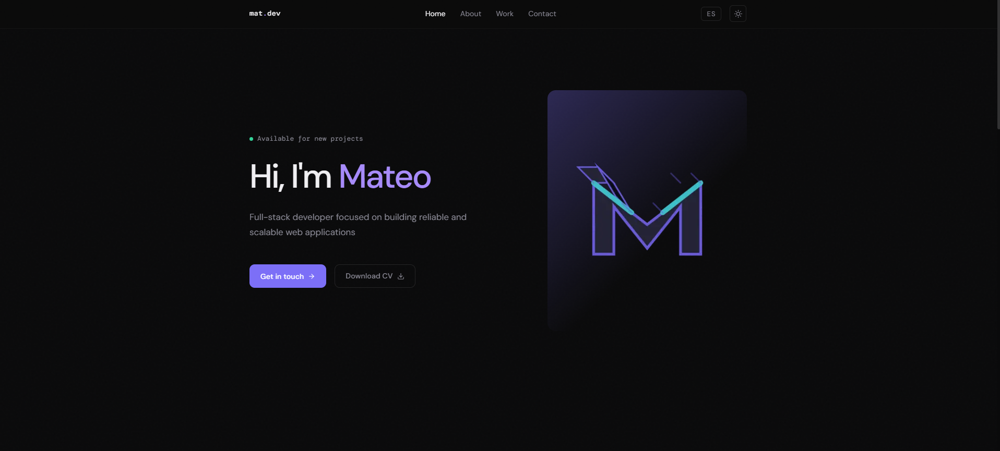

# 🚀 Mathw Portfolio

Modern developer portfolio built to showcase my projects, skills, and experience as a web developer.

## ✨ Features

- 🌙 Dark / Light mode
- 🌐 Bilingual support (English / Spanish)
- 🎯 Smooth scrolling navigation
- 📊 Animated skill bars
- 📬 Contact form powered by Web3Forms
- 📱 Fully responsive design

---

## 🛠️ Tech Stack

- ⚡ Next.js  
- 🎨 Tailwind CSS  
- 🟨 JavaScript  
- 🌍 Web3Forms API  

---

## 📸 Preview

---

## 🌐 Live Demo

👉 https://mathw.dev/

---

## 📁 Project Structure

- portfolio/
-  │── public/        # Static assets
-  │── src/           # Main source code
-  │── components/    # Reusable UI components
-  │── pages/         # Application pages
-  │── styles/        # Global styles
-  │── README.md

## 📬 Contact 
- GitHub: https://github.com/DevMathw
- Email: dev.mathew.coded@gmail.com